# Automated EC2 Instance Scheduling
## Using AWS Lambda and Amazon EventBridge

<p align="center">
  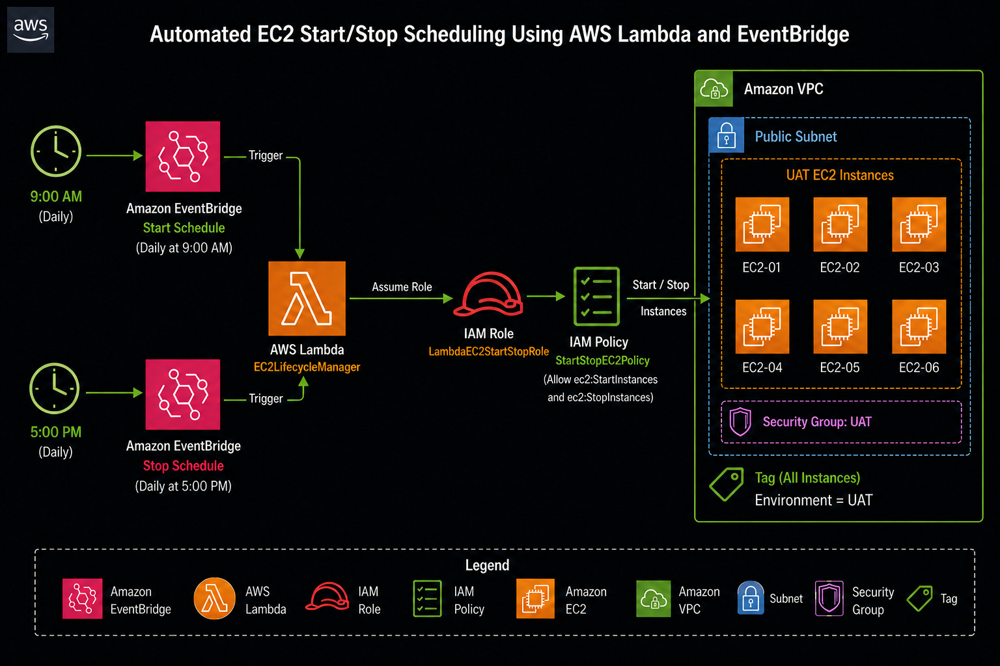
</p>

*Figure 1: High-level architecture — Amazon EventBridge triggers an AWS Lambda function to start and stop tagged EC2 instances on a defined schedule.* 

## 1. Project Overview

This project demonstrates hands-on experience in automating the scheduled start and stop of Amazon EC2 instances. The instances are automatically started each morning before business hours begin and stopped at the end of the working day. The primary objective is cost optimization: EC2 instances that run continuously outside of business hours incur unnecessary charges. By implementing automated scheduling, organizations can significantly reduce compute costs without requiring manual intervention from cloud engineers.
The solution achieves the following operational goals:
*	Eliminate idle EC2 compute costs outside of business hours.
*	Remove the operational overhead of manually starting and stopping instances.
* Enforce consistent uptime schedules across all tagged instances.
* Maintain full auditability through CloudWatch logging.

The automation is implemented using a serverless, event-driven architecture leveraging Amazon EventBridge for scheduling and AWS Lambda for execution. EC2 instances are identified using resource tags, making the solution scalable and easily extensible to additional instances without modifying the underlying code.

**Note:** From a security standpoint, a private subnet with a NAT Gateway would be the ideal network configuration for production workloads. However, due to the additional cost of NAT Gateways — one of the more expensive AWS networking components — a public subnet was used for this project. In a production environment, the NAT Gateway approach is strongly recommended to avoid exposing instance network interfaces directly to the internet.

## 2. Architecture

This solution is built on a lightweight, serverless architecture consisting of the following AWS components:

### Amazon VPC
Provides a logically isolated, customizable virtual network within AWS. All project resources are deployed within this VPC to ensure network-level isolation and control.
### Public Subnet
A subnet within the VPC configured to route traffic to the internet via an Internet Gateway. The EC2 instances are placed in this subnet for this project.
### Security Group
Acts as a stateful virtual firewall for the EC2 instances, controlling inbound and outbound traffic at the instance level based on defined rules.
### Amazon EventBridge
A serverless event bus that enables the creation of fine-grained cron-based schedules. In this solution, EventBridge serves as the trigger mechanism, invoking the Lambda function at configured start and stop times.
### AWS Lambda
A serverless compute service that executes the Python-based automation code in response to EventBridge triggers. Lambda requires no server provisioning or management and charges only for actual execution time.
### IAM Role and IAM Policy
The IAM role grants the Lambda function a temporary, least-privilege identity to interact with AWS services. The attached IAM policy explicitly defines the permitted actions: describing, starting, and stopping EC2 instances, as well as publishing logs to Amazon CloudWatch.

**The workflow operates as follows:**
1.	Amazon EventBridge evaluates the configured cron schedule.
2.	At the designated time, EventBridge invokes the Lambda function and passes a JSON payload specifying the action ("start" or "stop").
3.	The Lambda function authenticates using its attached IAM role and retrieves EC2 instances matching the configured tag filter.
4.	The function calls the appropriate EC2 API action on the identified instances.
5.	Execution logs, including matched instances and action results, are published to Amazon CloudWatch Logs for monitoring and auditability.

## 3. Prerequisites
Before implementing this solution, ensure the following requirements are met:
* An active AWS account with access to the AWS Management Console.
* Basic to intermediate familiarity with core AWS concepts, including VPC, EC2, IAM, Lambda, and EventBridge.
* A pre-configured VPC with at least one subnet.
* A minimum of two EC2 instances to participate in the automation.
* Familiarity with JSON for writing IAM policies and EventBridge event payloads.
* Basic understanding of Python (for reviewing and customizing the Lambda function).

## 4. Implementation
### Step 1: Networking — VPC and Subnet Configuration
#### 1.1  Creating the VPC
An Amazon VPC was created with the following configuration:
*	Name tag: UAT-VPC
*	IPv4 CIDR block: 10.0.0.0/16
The /16 CIDR block provides up to 65,536 IP addresses, offering sufficient address space for future growth.
#### 1.2  Creating the Subnet
A public subnet was created within the VPC using the following settings:
* Subnet name: Public-Subnet-1
* Availability Zone: Europe (Stockholm) — eu-north-1a
*	VPC IPv4 CIDR block: 10.0.0.0/16
*	Subnet IPv4 CIDR block: 10.0.1.0/24
The /24 subnet provides 256 IP addresses (251 usable), which is appropriate for this workload.

<p align="center">
  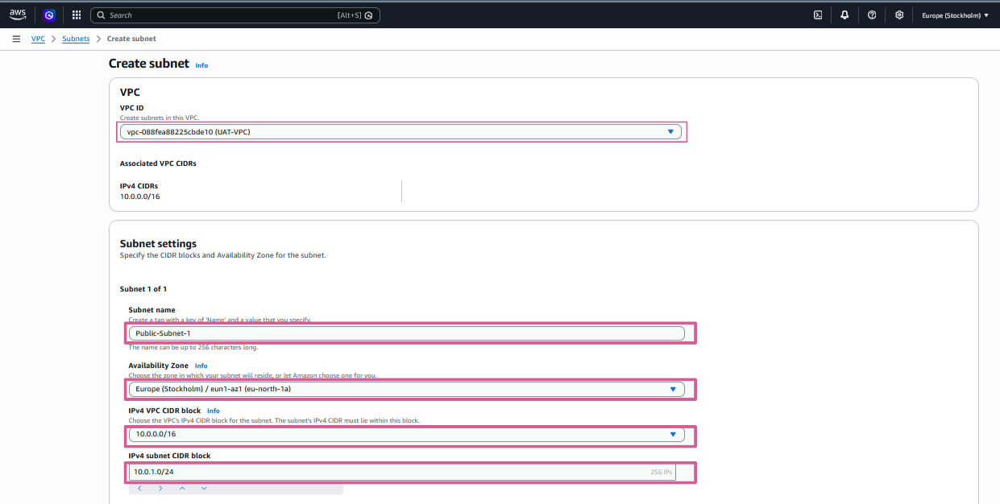
</p>

*Figure 2: Subnet configuration showing the subnet name, Availability Zone, VPC CIDR block, and subnet CIDR block.*

#### 1.3  Enabling Auto-Assign Public IP
Auto-assign Public IP was enabled on the subnet so that instances launched into it automatically receive a public IPv4 address, enabling outbound internet connectivity.
#### 1.4  Creating and Attaching the Internet Gateway
An Internet Gateway (UAT-IGW) was created and attached to UAT-VPC. The Internet Gateway allows resources within the public subnet to communicate with the public internet.
#### 1.5  Adding the Internet Route
A route was added to the VPC route table with the following configuration:
* Destination: 0.0.0.0/0 (all internet traffic)
* Target: UAT-IGW (the Internet Gateway)
This route ensures that all outbound traffic from the subnet is directed to the Internet Gateway.

<p align="center">
  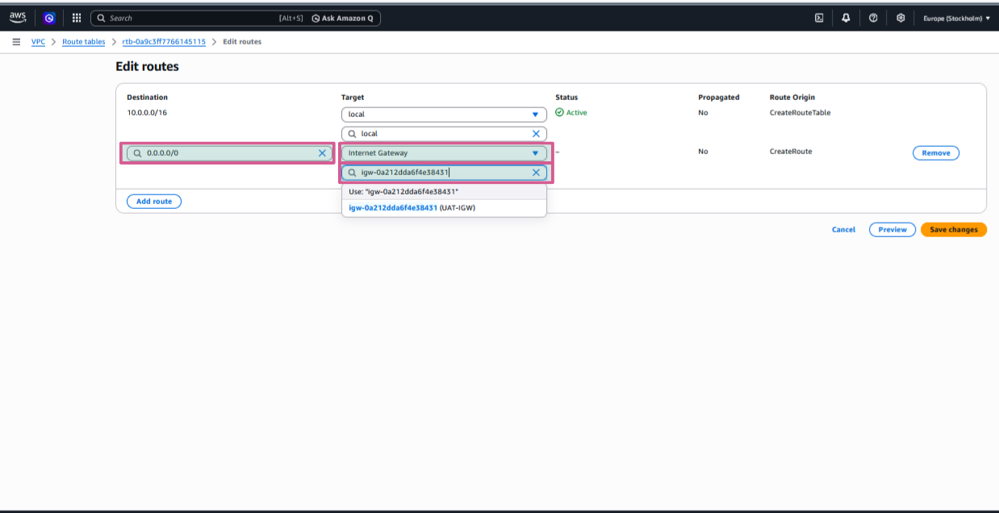
</p>

*Figure 3: Route table entry directing all internet-bound traffic (0.0.0.0/0) to the Internet Gateway.*
#### 1.6  Associating the Route Table with the Public Subnet
The route table containing the internet route was associated with Public-Subnet-1, completing the public subnet configuration. Instances in this subnet can now route traffic to and from the internet.
### Step 2: Security Group Configuration
A security group (UAT-Web-SG) was created to act as a virtual firewall for the EC2 instances. The following inbound rules were configured:

| Type  | Protocol | Port Range | Source                     |
|-------|-----------|-------------|----------------------------|
| SSH   | TCP       | 22          | My IP (restricted)         |
| HTTP  | TCP       | 80          | 0.0.0.0/0 (Anywhere)       |
| HTTPS | TCP       | 443         | 0.0.0.0/0 (Anywhere)       |

**Note:** SSH access is restricted to "My IP" rather than "Anywhere" (0.0.0.0/0). This is an important security best practice, as it limits SSH access to only the engineer's current IP address and prevents unauthorized remote access attempts from the public internet.

<p align="center">
  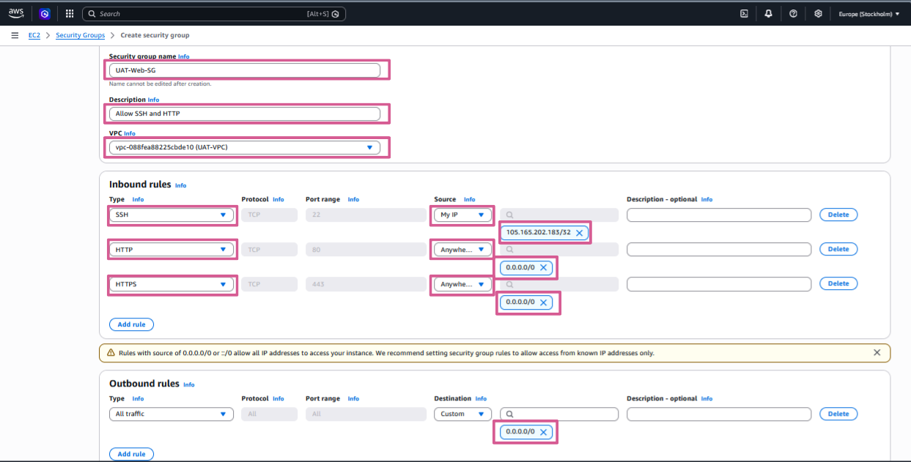
</p>

*Figure 4: Security group inbound rules showing SSH restricted to My IP, with HTTP and HTTPS open to all sources.*

### Step 3: Launching EC2 Instances
Two EC2 instances were launched into the public subnet using the following configuration:
* AMI: Amazon Linux 2023
* Instance type: t3.micro

<p align="center">
  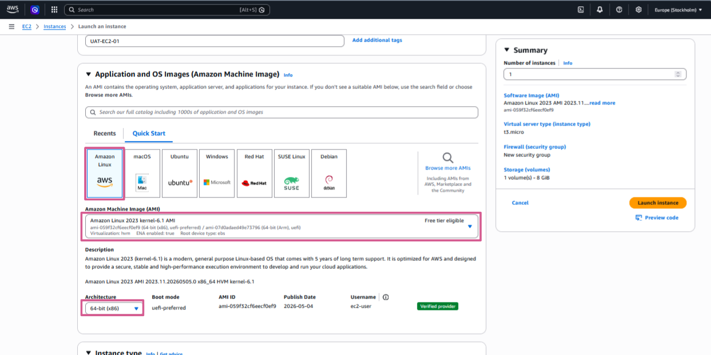
</p>

*Figure 5: Instance configuration showing the selected AMI (Amazon Linux 2023), instance type (t3.micro), and architecture.*

The following network settings were applied during launch:
| Resource                | Value            |
|-------------------------|------------------|
| VPC                     | UAT-VPC          |
| Subnet                  | Public-Subnet-1  |
| Auto-assign Public IP   | Enabled          |
| Security Group          | UAT-Web-SG       |

<p align="center">
  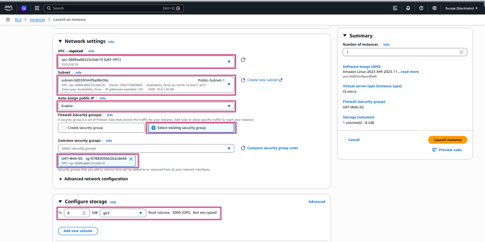
</p>

*Figure 6: Network settings applied during EC2 instance launch, including VPC, subnet, public IP assignment, and security group.*

### Step 4: Tagging EC2 Instances
Resource tagging is the mechanism by which the Lambda function identifies which instances to manage. All instances participating in the automation were tagged with a consistent key-value pair:
* Key: environment
* Value: UAT
Using tags as the selection mechanism makes the solution scalable. Additional instances can be included in or excluded from the automation simply by adding or removing the tag, without any changes to the Lambda code.

<p align="center">
  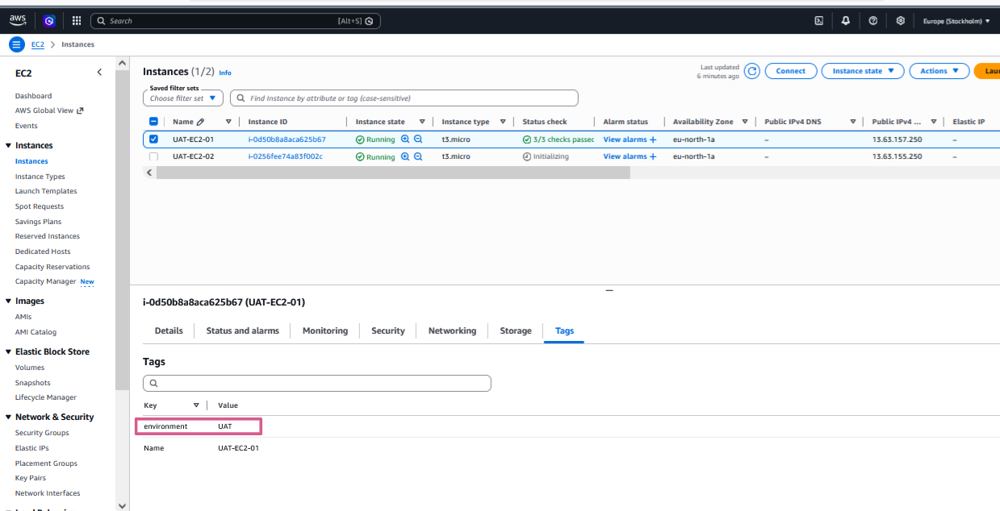
</p>

*Figure 7: EC2 instance tags. All instances included in the automation share the same "environment=UAT" tag.*

### Step 5: Creating the IAM Policy
An IAM policy was created to define the minimum permissions required for the Lambda function to operate. Following the principle of least privilege, the policy grants only the permissions necessary for the automation workflow and no more.

<p align="center">
  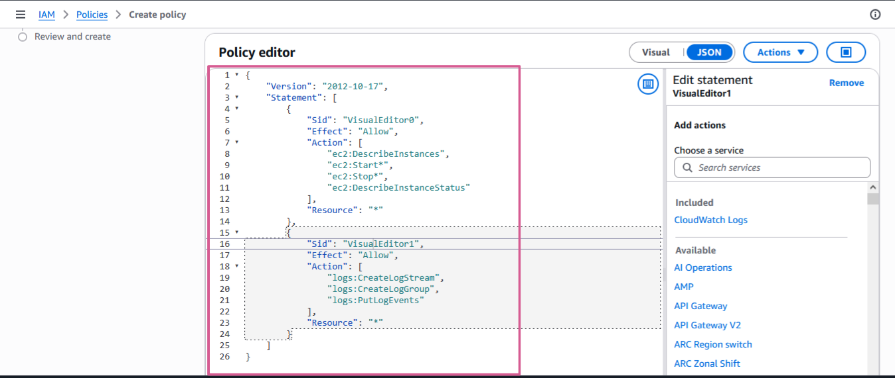
</p>

*Figure 8: IAM policy shown in the policy editor, defining EC2 management and CloudWatch Logs permissions.*

**The Policy**

```json
{
  "Version": "2012-10-17",
  "Statement": [
    {
      "Sid": "VisualEditor0",
      "Effect": "Allow",
      "Action": [
        "ec2:DescribeInstances",
        "ec2:Start*",
        "ec2:Stop*",
        "ec2:DescribeInstanceStatus"
      ],
      "Resource": "*"
    },
    {
      "Sid": "VisualEditor1",
      "Effect": "Allow",
      "Action": [
        "logs:CreateLogStream",
        "logs:CreateLogGroup",
        "logs:PutLogEvents"
      ],
      "Resource": "*"
    }
  ]
}
```
**Policy Explanation**

The policy contains two permission statements:

**Statement 1 — EC2 Instance Management (Sid: VisualEditor0):**
*	ec2:DescribeInstances — Allows the function to list and retrieve details of EC2 instances, which is required to resolve tag filters to instance IDs.
* ec2:Start* — Permits the function to start EC2 instances.
* ec2:Stop* — Permits the function to stop EC2 instances.
* ec2:DescribeInstanceStatus — Allows the function to query the current state of instances for validation and logging purposes.

**Statement 2 — CloudWatch Logs (Sid: VisualEditor1):**
* logs:CreateLogGroup — Allows Lambda to create a new log group if one does not already exist.
* logs:CreateLogStream — Allows Lambda to create log streams within the log group.
* logs:PutLogEvents — Allows Lambda to write log entries, enabling execution activity to be monitored and audited.

**Note:** The Resource field is set to "*" (all resources) for simplicity in this project. In a production environment, this should be scoped down to specific resource ARNs to further restrict access in accordance with the principle of least privilege.

### Step 6: Creating the IAM Execution Role
An IAM execution role was created for the Lambda function. The role establishes a trust relationship that allows the AWS Lambda service to assume it during function execution. The IAM policy created in the previous step was attached to this role, granting the function its operational permissions.

<p align="center">
  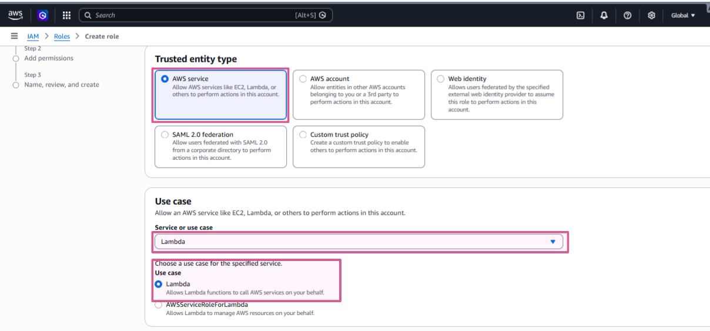
</p>

*Figure 9: IAM execution role creation for the Lambda function, with the custom EC2 policy attached.*

### Step 7: Creating the Lambda Function
The Lambda function serves as the automation engine. Named LambdaEC2StartStopFunction, the function is written in Python and uses the AWS SDK for Python (Boto3) to interact with the EC2 API.

Key function configuration:
* Runtime: Python 3.x
* Execution role: The IAM role created in Step 6
* Trigger: Amazon EventBridge (configured in Step 8)
* Logging: Amazon CloudWatch Logs (enabled via the IAM policy)

<p align="center">
  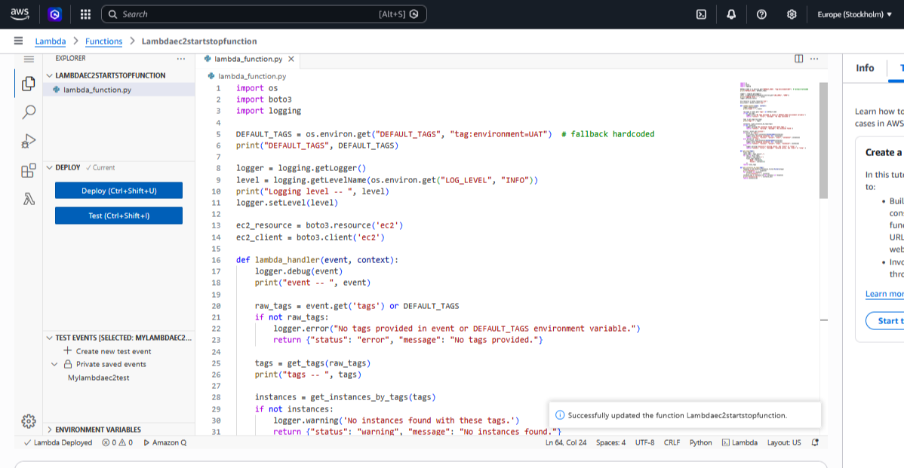
</p>

*Figure 10: Lambda function deployment showing the function code in the AWS Console.*

**Lambda Function Code**

```python
import os
import boto3
import logging

DEFAULT_TAGS = os.environ.get("DEFAULT_TAGS", "tag:environment=UAT")

logger = logging.getLogger()
level = logging.getLevelName(os.environ.get("LOG_LEVEL", "INFO"))
logger.setLevel(level)

ec2_resource = boto3.resource("ec2")
ec2_client  = boto3.client("ec2")

def lambda_handler(event, context):
    raw_tags = event.get("tags") or DEFAULT_TAGS
    if not raw_tags:
        logger.error("No tags provided.")
        return {"status": "error", "message": "No tags provided."}

    tags      = get_tags(raw_tags)
    instances = get_instances_by_tags(tags)

    if not instances:
        logger.warning("No instances found with these tags.")
        return {"status": "warning", "message": "No instances found."}

    action = event.get("action")
    if action == "start":
        ec2_client.start_instances(InstanceIds=instances)
        logger.info("Starting instances: %s", instances)
        return {"status": "success", "action": "start", "instances": instances}
    elif action == "stop":
        ec2_client.stop_instances(InstanceIds=instances)
        logger.info("Stopping instances: %s", instances)
        return {"status": "success", "action": "stop", "instances": instances}
    else:
        logger.warning("Invalid action. Use \"start\" or \"stop\".")
        return {"status": "error", "message": "Invalid action."}

def get_tags(tags):
    return [{"Name": v[0], "Values": [v[1]]}
            for t in tags.split(",") for v in [t.split("=")]]

def get_instances_by_tags(tags):
    response = ec2_resource.instances.filter(Filters=tags)
    return [i.id for i in response]
```
**Code Walkthrough**

The Lambda function is structured around two supporting functions and one main handler:

* **lambda_handler(event, context):**

This is the entry point invoked by EventBridge. It reads the incoming event payload to extract the target tags and the requested action ("start" or "stop"). It delegates instance discovery to get_instances_by_tags() and then calls the appropriate EC2 API. All significant events — including matched instances, actions taken, and error conditions — are logged for observability.

* **get_tags(tags):**

Parses the tag string (e.g., "tag:environment=UAT") into the AWS-compatible filter format required by the EC2 resource filter API. This enables the function to dynamically resolve tag specifications into structured filter objects.

* **get_instances_by_tags(tags):**

Queries the EC2 service for all instances matching the provided tag filters and returns a list of matching instance IDs. This list is then passed to the start or stop API call.
The function also includes input validation guards that return structured error responses when required inputs — such as tags or a valid action — are missing or invalid. This makes the function more robust and easier to debug.

### Step 7b: Configuring Lambda Environment Variables
Environment variables were configured on the Lambda function to externalize key configuration values, keeping the function code generic and reusable across environments without requiring code changes.

The following environment variables were defined:
* DEFAULT_TAGS — Specifies the default tag filter used to identify target instances (e.g., tag:environment=UAT). This value can be overridden per invocation via the EventBridge event payload.
* LOG_LEVEL — Controls the verbosity of function logging (e.g., INFO, DEBUG). Setting this externally allows log detail to be adjusted without redeploying the function.

  <p align="center">
  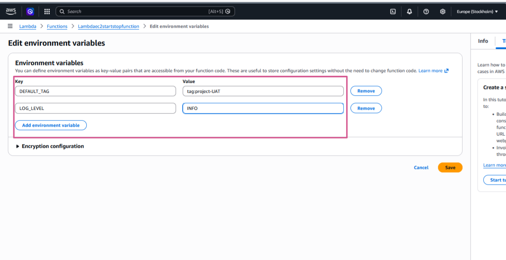
</p>

*Figure 11: Lambda environment variables configured for the function, showing DEFAULT_TAGS and LOG_LEVEL.*

**Start Schedule — Cron Expression**
The following cron expression triggers the start action at 08:00 UTC, Monday through Friday:

`cron(0 8 ? * MON-FRI *)`

| Field         | Value                  |
|----------------|------------------------|
| Minutes        | 0                      |
| Hours          | 8 (08:00 UTC)          |
| Day of month   | ? (any)                |
| Month          | * (every month)        |
| Day of week    | MON-FRI (weekdays only)|
| Year           | * (every year)         |

### Stop Schedule — Cron Expression

The following cron expression triggers the stop action at 18:00 UTC, Monday through Friday:

`cron(0 18 ? * MON-FRI *)`

| Field         | Value                   |
|----------------|-------------------------|
| Minutes        | 0                       |
| Hours          | 18 (18:00 UTC)          |
| Day of month   | ? (any)                 |
| Month          | * (every month)         |
| Day of week    | MON-FRI (weekdays only) |
| Year           | * (every year)          |

<p align="center">
  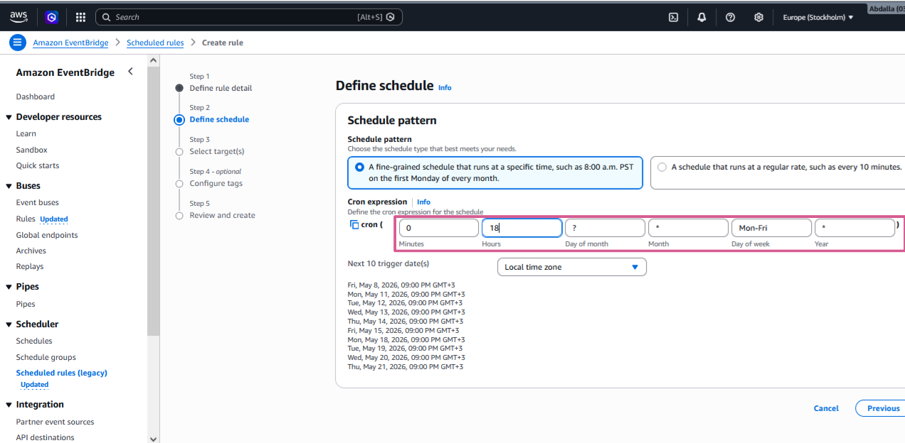
</p>

*Figure 12: EventBridge cron expression for the stop schedule. A corresponding rule with identical configuration but a different hour value is used for the start schedule.*

**EventBridge Target Payloads**
Each EventBridge schedule is configured with a JSON input payload that instructs the Lambda function which action to perform. The payloads are as follows:


**Start payload:**
```json
{ "action": "start" }
```
**Stop payload:**
```json
{ "action": "stop" }
```
These lightweight payloads are passed directly into the lambda_handler event parameter, allowing the same Lambda function to handle both start and stop operations based solely on the value of the "action" key.

## 5. Validation and Results
To validate the solution without waiting until the scheduled business-hours window, an additional EventBridge rule was created with a stop trigger set to fire a few minutes after the project was completed (17:20 UTC). This allowed immediate end-to-end verification of the automation workflow.

The EC2 instances transitioned from a running state to a stopped state at exactly the configured time, confirming that:
* The EventBridge schedule fired at the correct time.
* The Lambda function was successfully invoked.
* The tag filter correctly identified the target instances.
* The stop API call executed successfully on all tagged instances.

  <p align="center">
  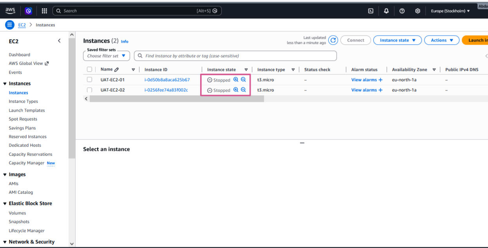
</p>

*Figure 13: EC2 console showing both instances in the "stopped" state following the execution of the Lambda stop function.*

**CloudWatch Logs Verification**

The Lambda execution was further validated through the CloudWatch Logs output. The logs confirm that at exactly 17:20 UTC, the function:
* Received the EventBridge trigger with the "stop" action.
* Resolved the "tag:environment=UAT" filter from the DEFAULT_TAGS environment variable.
* Identified the matching EC2 instances by their tag.
* Executed the stop API call and logged the targeted instance IDs.

 <p align="center">
  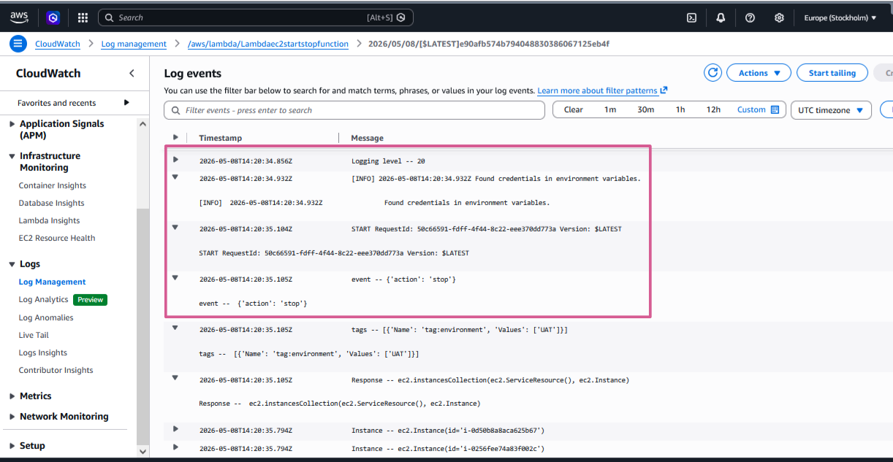
</p>

*Figure 14: CloudWatch Logs output from the Lambda execution, showing the timestamp, matched tag filter, and successful stop action at 17:20 UTC.*
## 6. Skills and Competencies Demonstrated
This project demonstrates practical, hands-on proficiency in the following AWS services and cloud engineering disciplines:

### Networking
*	Designing and configuring an Amazon VPC with a defined CIDR block.
* Creating and configuring public subnets, including CIDR allocation and Availability Zone selection.
* Deploying and attaching an Internet Gateway and configuring route tables for internet connectivity.
* Associating route tables with subnets to complete public subnet configuration.
### Security
* Designing and applying IAM policies following the principle of least privilege.
* Creating and configuring IAM execution roles with service trust policies.
* Configuring security group rules with appropriate source restrictions (e.g., SSH limited to My IP).
### Compute
* Launching EC2 instances with appropriate AMIs, instance types, and network configurations.
* Applying resource tags to EC2 instances for programmatic identification and management.
### Serverless and Automation
* Developing a Python-based AWS Lambda function using the Boto3 SDK.
* Implementing environment variables in Lambda for configuration management.
* Designing a tag-driven, reusable automation framework for EC2 lifecycle management.
### Scheduling and Event-Driven Architecture
* Creating fine-grained cron-based schedules using Amazon EventBridge.
* Configuring EventBridge to pass structured JSON payloads to Lambda targets.
* Building an event-driven automation pipeline with decoupled scheduling and execution layers.
### Monitoring and Observability
* Configuring Lambda to publish structured execution logs to Amazon CloudWatch Logs.
* Using CloudWatch Logs to validate automation outcomes and troubleshoot execution.
## 7. Key Lessons Learned
* Proper VPC design is foundational. Deploying EC2 instances requires careful planning of IP addressing, subnetting, routing, and internet connectivity before any compute resources are launched.
* Tags are a powerful resource management mechanism in AWS. Designing a consistent tagging strategy from the outset makes automation, cost allocation, and resource identification significantly easier.
* The principle of least privilege is not just a security recommendation — it is an operational discipline. Scoping IAM policies to only the required actions and resources reduces the blast radius of any potential misconfiguration.
* Serverless architectures eliminate operational overhead. Lambda and EventBridge together provide a highly reliable, low-maintenance automation platform that requires no server management.
* Observability is essential. Configuring CloudWatch logging from the beginning enabled rapid validation and debugging of the automation workflow.
* Cost awareness should inform architecture decisions. The choice between a NAT Gateway and a public subnet is a practical example of balancing security best practices against real-world cost constraints.


